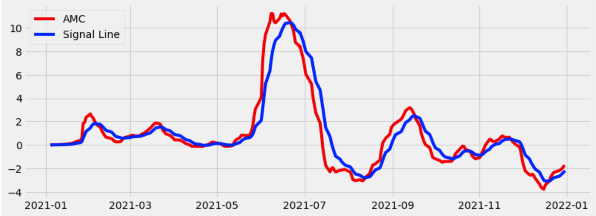
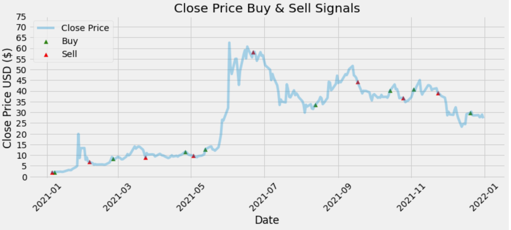

# Algorithmic-Trading-with-MACD

  <h3 align="center">Algorithmic Trading Strategy with MACD</h3>

## About The Project

This uses program use MACD crossover to determine when to buy and sell a stock.
MACD, which stands for moving average convergence/divergence, is a trading indicator
used in stock price technical analysis. It is intended to reveal changes in the strength, 
direction, momentum, and duration of a stock's price trend. The MACD indicator is made up 
of three time series that are calculated from historical price data, most commonly the closing price.

A list resources that I find helpful is listed in the acknowledgments.

## Built With

Jupyter Notebook and Python Programming.
Libraries: pandas_datareader, numpy, pandas, matplotlib, keras.

## Usage

## Authors

* **Ellis Sentoso** - *Data Science Student* - [Ellis Sentoso](https://github.com/ellissentoso) - *Algorithmic Trading Strategy with MACD*

## Acknowledgements

* [Computer Science] (https://www.youtube.com/watch?v=kz_NJERCgm8)

